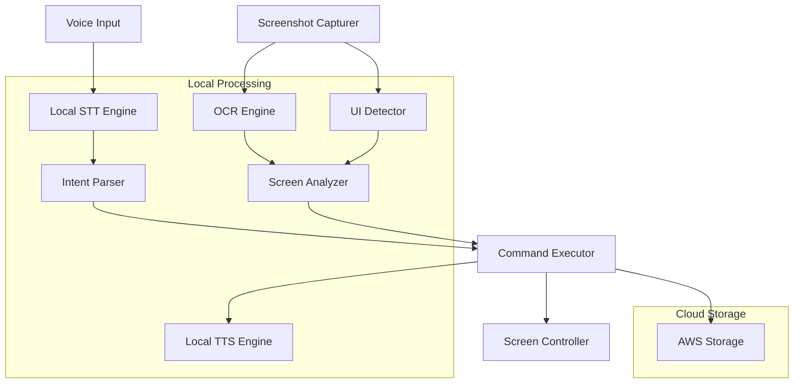

# Design Document

## Overview

This design document outlines the architecture for migrating Heimdall from paid API services to a fully open-source stack while maintaining AWS cloud storage capabilities. The new architecture emphasizes local processing, offline functionality, and cost-effective operation while preserving all accessibility features for visually impaired users.

## Architecture

### High-Level System Architecture



### Component Replacement Strategy

| Current Component | Replacement | Rationale |
|------------------|-------------|-----------|
| OpenAI Whisper API | Whisper.cpp / Vosk | Local processing, no API costs |
| GPT-4o | Google Gemini Free API | Free AI inference, excellent NLU |
| ElevenLabs TTS | Coqui TTS / espeak-ng | Open-source voice synthesis |
| Paid OCR Services | Tesseract (enhanced) | Already in use, optimize configuration |
| YOLOv8 (if paid) | YOLOv8 (open-source) | Free computer vision |
| AWS S3/DynamoDB | Keep as-is | Free tier sufficient, proven reliability |

## Components and Interfaces

### 1. Speech-to-Text Engine

**Implementation Options:**
- **Whisper.cpp**: C++ implementation of OpenAI Whisper for better performance
- **Vosk**: Lightweight, real-time speech recognition

```python
class LocalSTTEngine:
    def __init__(self, engine_type: str = "whisper_cpp"):
        self.engine_type = engine_type
        self.model = self._load_model()
    
    async def transcribe_audio(self, audio_data: bytes) -> STTResult:
        """Transcribe audio using local STT engine"""
        pass
    
    def get_available_models(self) -> List[str]:
        """Return list of available STT models"""
        pass
    
    def switch_engine(self, engine_type: str) -> bool:
        """Switch between Whisper.cpp and Vosk"""
        pass

@dataclass
class STTResult:
    text: str
    confidence: float
    processing_time: float
    language: str
```

### 2. Screenshot and Image Processing

**Enhanced Implementation:**
- **Pillow + MSS**: Cross-platform screenshot capture
- **OpenCV**: Image preprocessing and enhancement

```python
class ScreenshotCapturer:
    def __init__(self):
        self.monitors = mss.mss().monitors
        self.capture_interval = 30
    
    async def capture_screen(self, monitor_id: Optional[int] = None) -> ScreenCapture:
        """Capture screenshot from specified monitor"""
        pass
    
    async def capture_all_monitors(self) -> List[ScreenCapture]:
        """Capture screenshots from all monitors"""
        pass
    
    def preprocess_image(self, image: PIL.Image) -> PIL.Image:
        """Enhance image for better OCR/CV processing"""
        pass

class ImageProcessor:
    def enhance_for_ocr(self, image: PIL.Image) -> PIL.Image:
        """Apply OCR-specific image enhancements"""
        # Contrast adjustment, noise reduction, deskewing
        pass
    
    def enhance_for_ui_detection(self, image: PIL.Image) -> PIL.Image:
        """Prepare image for UI element detection"""
        pass
```

### 3. OCR and Computer Vision Engine

**Enhanced Tesseract + YOLOv8 Integration:**

```python
class EnhancedOCREngine:
    def __init__(self):
        self.tesseract_config = self._optimize_tesseract_config()
        self.ui_detector = YOLOv8UIDetector()
    
    async def extract_text(self, image: PIL.Image) -> List[TextBlock]:
        """Extract text with enhanced preprocessing"""
        pass
    
    def get_text_with_confidence(self, image: PIL.Image) -> List[TextResult]:
        """Return text with confidence scores"""
        pass

class YOLOv8UIDetector:
    def __init__(self, model_path: str = "yolov8_ui_elements.pt"):
        self.model = YOLO(model_path)
    
    def detect_ui_elements(self, image: PIL.Image) -> List[UIElement]:
        """Detect buttons, forms, menus, etc."""
        pass
    
    def classify_elements(self, elements: List[UIElement]) -> List[ClassifiedElement]:
        """Classify detected elements by type and interaction possibility"""
        pass

@dataclass
class UIElement:
    element_type: str  # button, input, menu, text, image
    bounds: Rectangle
    confidence: float
    text_content: Optional[str]
    attributes: Dict[str, Any]
```

### 4. Gemini AI Integration

**Google Gemini Free API for Intent Parsing:**

```python
class GeminiIntentParser:
    def __init__(self, api_key: str):
        import google.generativeai as genai
        genai.configure(api_key=api_key)
        self.model = genai.GenerativeModel('gemini-pro')
        self.context_window = []
    
    async def parse_intent(self, command: str, screen_context: ScreenContext) -> CommandIntent:
        """Parse user command into actionable intent using Gemini"""
        pass
    
    async def generate_clarification(self, ambiguous_command: str) -> str:
        """Generate clarifying questions for unclear commands"""
        pass
    
    def update_context(self, command: str, result: ActionResult):
        """Maintain conversation context"""
        pass
    
    def _handle_rate_limit(self) -> bool:
        """Handle API rate limiting gracefully"""
        pass

class FallbackIntentParser:
    """Rule-based fallback when Gemini API is unavailable"""
    def __init__(self):
        self.command_patterns = self._load_command_patterns()
    
    def parse_simple_commands(self, text: str) -> Optional[CommandIntent]:
        """Handle basic commands using pattern matching"""
        pass
```

### 5. Text-to-Speech Engine

**Multi-Engine TTS Support:**

```python
class LocalTTSEngine:
    def __init__(self, engine_type: str = "coqui"):
        self.engine_type = engine_type
        self.engine = self._initialize_engine()
    
    async def synthesize_speech(self, text: str) -> bytes:
        """Convert text to speech audio"""
        pass
    
    def set_voice_parameters(self, voice_id: str, speed: float, pitch: float):
        """Configure voice characteristics"""
        pass
    
    def get_available_voices(self) -> List[VoiceModel]:
        """Return available voice models"""
        pass

class CoquiTTSEngine:
    """Coqui TTS implementation"""
    def __init__(self):
        self.tts = TTS(model_name="tts_models/en/ljspeech/tacotron2-DDC")
    
    def synthesize(self, text: str) -> bytes:
        pass

class EspeakTTSEngine:
    """espeak-ng implementation for lightweight TTS"""
    def synthesize(self, text: str) -> bytes:
        pass
```

### 6. Screen Control and Automation

**Enhanced PyAutoGUI with Accessibility APIs:**

```python
class ScreenController:
    def __init__(self):
        self.pyautogui = pyautogui
        self.accessibility_api = self._init_accessibility_api()
    
    async def click_element(self, element: UIElement) -> ActionResult:
        """Click on detected UI element"""
        pass
    
    async def type_text(self, text: str, target_element: Optional[UIElement] = None) -> ActionResult:
        """Type text, optionally targeting specific element"""
        pass
    
    async def scroll(self, direction: str, amount: int = 3) -> ActionResult:
        """Perform scroll actions"""
        pass
    
    def _init_accessibility_api(self):
        """Initialize OS-specific accessibility APIs"""
        if platform.system() == "Darwin":  # macOS
            return MacOSAccessibilityAPI()
        elif platform.system() == "Windows":
            return WindowsAccessibilityAPI()
        else:  # Linux
            return LinuxAccessibilityAPI()

class AccessibilityAPI:
    """Base class for OS-specific accessibility APIs"""
    def find_element_by_role(self, role: str) -> Optional[AccessibleElement]:
        pass
    
    def get_element_properties(self, element: AccessibleElement) -> Dict[str, Any]:
        pass
```

### 7. Configuration Management

**Centralized Configuration System:**

```python
@dataclass
class SystemConfig:
    # STT Configuration
    stt_engine: str = "whisper_cpp"  # whisper_cpp, vosk
    whisper_model: str = "base"      # tiny, base, small, medium, large
    vosk_model: str = "vosk-model-en-us-0.22"
    
    # TTS Configuration
    tts_engine: str = "coqui"        # coqui, espeak
    voice_speed: float = 1.0
    voice_pitch: float = 1.0
    
    # AI Configuration
    ai_model: str = "gemini-pro"     # gemini-pro, gemini-pro-vision
    gemini_api_key: str = ""
    fallback_to_rules: bool = True
    rate_limit_handling: bool = True
    
    # Screenshot Configuration
    screenshot_interval: int = 30
    auto_cleanup_days: int = 7
    max_screenshots: int = 1000
    
    # AWS Configuration
    use_aws_storage: bool = True
    s3_bucket: str = "heimdall-screenshots"
    dynamodb_table: str = "heimdall-logs"
    
    # Performance Configuration
    max_processing_time: float = 5.0
    ocr_confidence_threshold: float = 0.7
    ui_detection_threshold: float = 0.5

class ConfigManager:
    def __init__(self, config_path: str = "config.yaml"):
        self.config_path = config_path
        self.config = self._load_config()
    
    def _load_config(self) -> SystemConfig:
        """Load configuration from YAML file"""
        pass
    
    def save_config(self):
        """Save current configuration to file"""
        pass
    
    def update_config(self, **kwargs):
        """Update configuration parameters"""
        pass
```

## Data Models

### Core Data Structures

```python
@dataclass
class ScreenContext:
    current_screen: ScreenCapture
    detected_elements: List[UIElement]
    extracted_text: List[TextBlock]
    layout_structure: LayoutTree
    interaction_map: Dict[str, UIElement]
    timestamp: datetime

@dataclass
class CommandIntent:
    action: str  # click, type, scroll, read, navigate
    target: Optional[str]
    parameters: Dict[str, Any]
    confidence: float
    requires_clarification: bool
    fallback_actions: List[str]

@dataclass
class ActionResult:
    success: bool
    action_taken: str
    target_element: Optional[UIElement]
    error_message: Optional[str]
    execution_time: float
    screenshot_after: Optional[ScreenCapture]
```

## Error Handling

### Graceful Degradation Strategy

1. **STT Failure**: Fall back to alternative STT engine or text input mode
2. **LLM Unavailable**: Use rule-based intent parsing
3. **OCR Low Confidence**: Request user confirmation or manual input
4. **UI Detection Failure**: Fall back to coordinate-based interaction
5. **TTS Failure**: Use alternative TTS engine or text output
6. **AWS Unavailable**: Continue with local storage only

### Error Recovery Patterns

```python
class ErrorHandler:
    def __init__(self):
        self.retry_strategies = {
            "stt_failure": self._handle_stt_failure,
            "llm_timeout": self._handle_llm_timeout,
            "ocr_low_confidence": self._handle_ocr_failure,
            "ui_detection_failure": self._handle_ui_failure,
            "tts_failure": self._handle_tts_failure
        }
    
    async def handle_error(self, error_type: str, context: Dict[str, Any]) -> ActionResult:
        """Handle specific error types with appropriate recovery"""
        pass
```

## Testing Strategy

### Unit Testing
- Individual component functionality
- Model loading and inference
- Configuration management
- Error handling scenarios

### Integration Testing
- End-to-end pipeline testing
- Cross-platform compatibility
- Performance benchmarking
- Accessibility compliance

### Performance Testing
- STT latency measurements
- LLM inference speed
- OCR processing time
- Memory usage optimization
- Battery impact assessment

## Deployment Considerations

### System Requirements
- **Minimum**: 8GB RAM, 4-core CPU, 10GB storage
- **Recommended**: 16GB RAM, 8-core CPU, 50GB storage
- **GPU**: Optional for faster LLM inference

### Installation Process
1. Install Python dependencies via pip
2. Download and configure local models (Whisper, Ollama, YOLOv8)
3. Set up AWS credentials (optional)
4. Configure system preferences
5. Run initial system tests

### Model Management
- Automatic model downloading on first run
- Model update mechanisms
- Storage optimization for multiple models
- Fallback model availability

## Security and Privacy

### Data Protection
- All processing occurs locally by default
- Optional AWS encryption for cloud storage
- No external API calls for core functionality
- User data anonymization options

### Access Control
- Local file system permissions
- AWS IAM role-based access
- Audit logging for all actions
- User consent for data collection

## Performance Optimization

### Processing Pipeline Optimization
- Async processing for all components
- Intelligent caching strategies
- Batch processing for multiple screenshots
- Resource usage monitoring and throttling

### Model Optimization
- Quantized models for faster inference
- Model switching based on system resources
- Lazy loading of heavy components
- Memory-mapped model storage